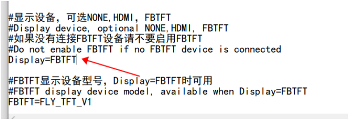
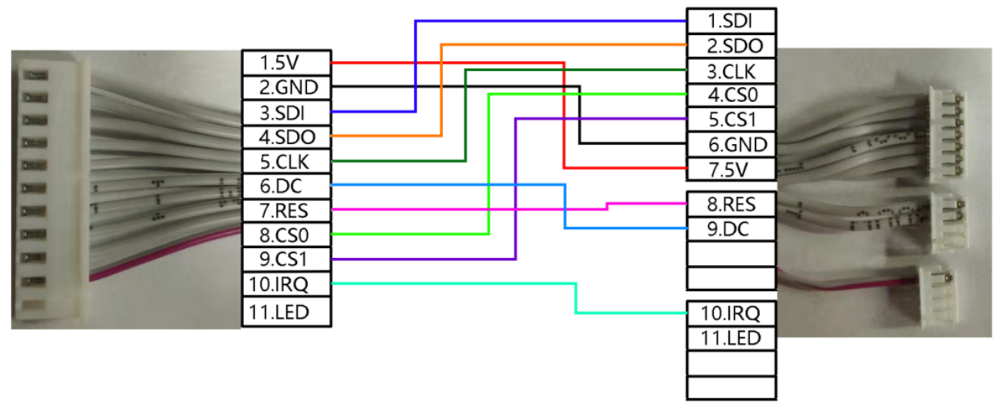
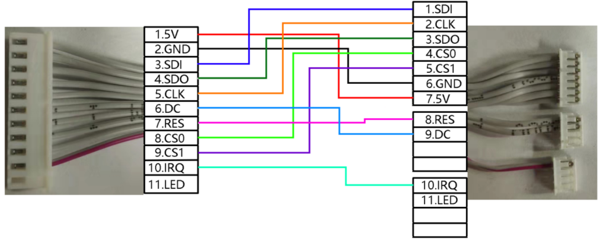
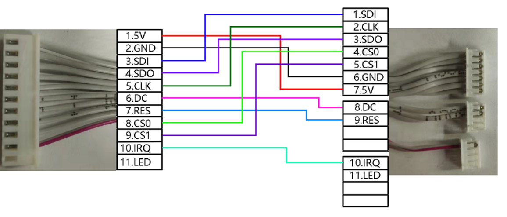
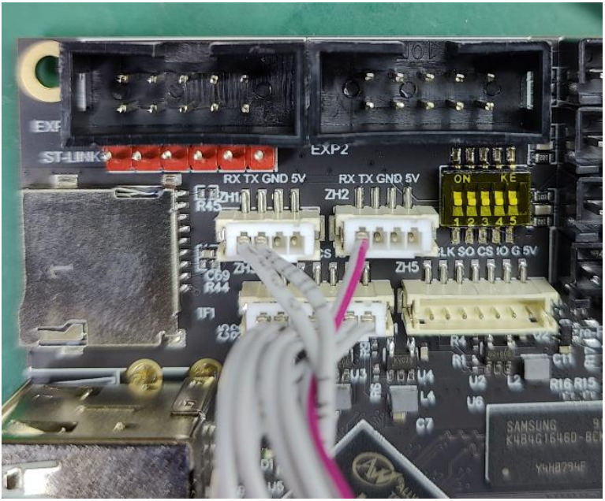
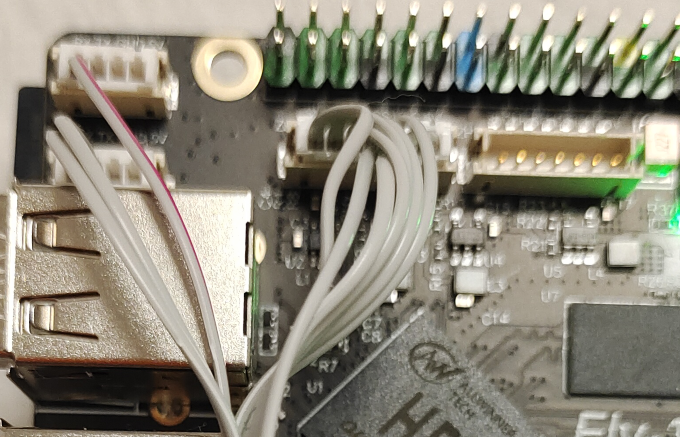

# 屏幕使用

## Mini 12864 LCD

* 正确连接到EXP接口，将示例配置中的mini12864部分取消注释

## FLY TFT V1

* 开始使用tft前确认已阅读并完成[系统镜像](../introduction/system.md)部分文档

1. 烧录完成后会出现 BOOT 盘（如果未出现，请重新拔下 sd 卡，再插入电脑）

2. 打开BOOT盘下的**FLY-Config.conf**

3. 启用 klipperscreen
将`KlipperScreen=false`修改为`KlipperScreen=true`

4. 更改默认显示方式
将`Display=NONE`修改为`Display=FBTFT`

保存配置文件后弹出SD卡插到主板

5. 屏幕线需要自己接端子

* Gemini-v1接线图

* Gemini-v1.1接线图

* Gemini-v2和Fly-Pi接线图

6. 连接主板与屏幕

* FLY-Gemini

* FLY-Pi

1. 主板上电开机

?> 修改Display后首次开机时间较长，请耐心等待几分钟！