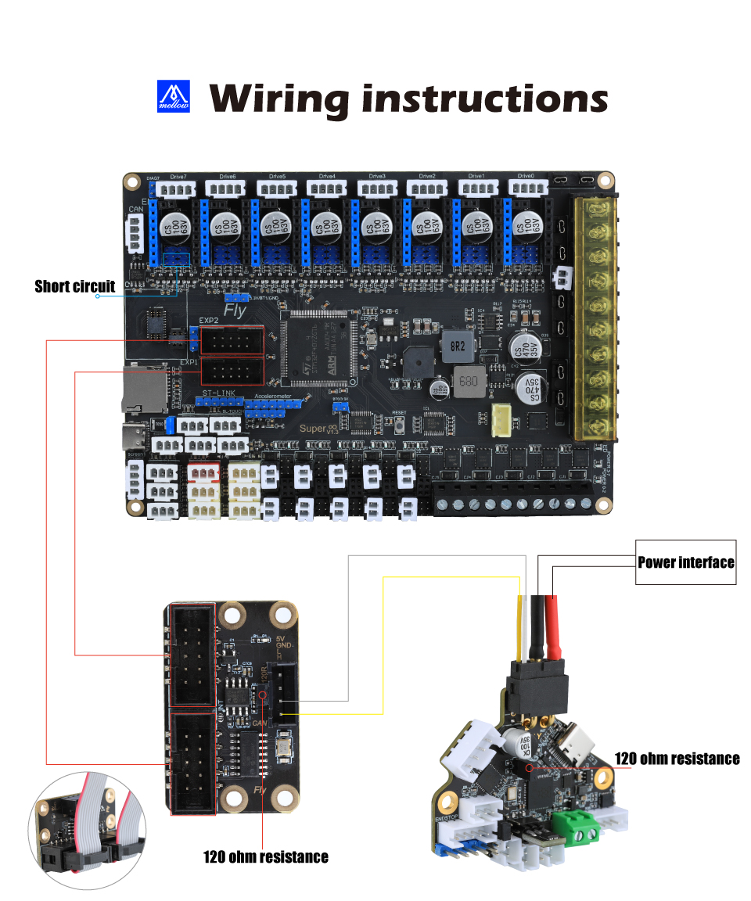

# 4. Super8 桥接CAN

CAN总线是一种用于实时应用的串行通讯协议总线，它可以使用双绞线来传输信号，是世界上应用最广泛的现场总线之一。CAN协议用于汽车中各种不同元件之间的通信，以此取代昂贵而笨重的配电线束。该协议的健壮性使其用途延伸到其他自动化和工业应用。CAN协议的特性包括完整性的串行数据通讯、提供实时支持、传输速率高达1Mb/s、同时具有11位的寻址以及检错能力。

3D打印机上使用CAN总线来减少打印头连接到主板的走线数量，原来需要十几根线，使用CAN后只需要使用四根线即可，大大减少走线数量，降低布线难度。

一般3D打印机上使用CAN需要使用U2C来将CAN信号转换成USB端口，而Super8板载了CAN收发器，因此CAN和主板共享通讯带宽来与上位机通讯，无需额外使用U2C来转换信号。板载CAN收发的方法也被称为**桥接CAN**。

本章只简要概述桥接CAN的使用.

## 4.1 RRF固件下载

RRF最新主板固件下载[RRF Config Tool (teamgloomy.github.io)](https://teamgloomy.github.io/Configurator)

## 4.2 CAN接线

?> H7主控不需要其他设备即可连接

?> 连接到主板后LED会降低闪烁速度

RRF接线，接线如下图所示

?> F4主控需要转接芯片才可使用RRF36

